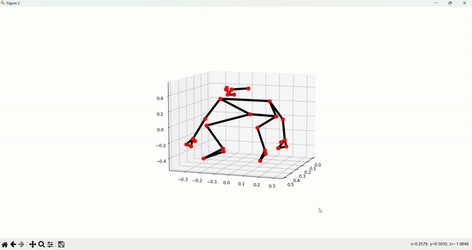
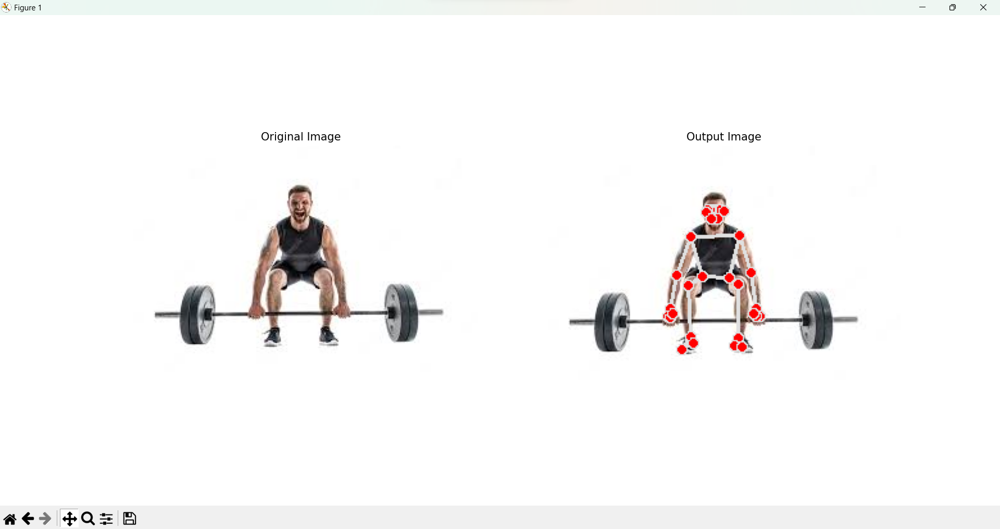

# PoseSense: Real-time Pose Detection & Mistake Analysis

This repository contains Python code for performing real-time pose detection on images and live video streams using MediaPipe and OpenCV. The implementation uses the MediaPipe Pose model to detect various body landmarks, enabling applications like fitness tracking, motion analysis, and real-time pose assessment.

## Table of Contents

- [Introduction](#introduction)
- [Requirements](#requirements)
- [Installation](#installation)
- [Usage](#usage)
   - [Pose Detection on Images](#pose-detection-on-images)
   - [Live Pose Detection](#live-pose-detection)
- [References](#references)

## Introduction

Pose detection is the process of identifying and locating key points on a person's body, such as joints and extremities. It plays a crucial role in various computer vision applications, including human-computer interaction, augmented reality, and activity recognition.

This project leverages the MediaPipe library, developed by Google, to perform accurate and real-time pose detection. The code provided includes two main functionalities:

1. Pose detection on static images: Given an image containing a person, the code detects and annotates the body landmarks on the image. This functionality is particularly useful for analyzing single images or image datasets.

2. Live pose detection using the webcam: The code captures the live video stream from the webcam and performs real-time pose detection, providing immediate feedback on the detected body landmarks.

## Requirements

Before running the code, ensure you have the following prerequisites:

- Python 3.x
- OpenCV (cv2)
- NumPy
- Matplotlib
- Pandas
- Mediapipe

You can install the required libraries using the following command:

```
pip install -r requirements.txt
```

The `requirements.txt` file contains the list of required libraries and their versions.

## Installation

To use this code, clone this repository to your local machine:

```
git clone https://github.com/Romihia/pose-detection-mistake-analysis.git
```

## Usage

### Pose Detection on Images


To perform pose detection on a static image, follow these steps:

1. Import the required modules:

```python
import os
import math
import cv2
import numpy as np
from time import time
import mediapipe as mp
import matplotlib.pyplot as plt
import pandas as pd
from Restrictions import Restriction
from cvzone.PoseModule import PoseDetector
```

2. Initialize the `PoseDetection` class:

```python
pose_detector = PoseDetection()
```

3. Use the `detect_pose` method to perform pose detection on an image:

```python
image_path = "path/to/your/image.jpg"
landmarks = pose_detector.detect_pose(image_path, display=True)
```

The `display` parameter determines whether the annotated image and 3D plot of landmarks are shown.


### Example of image activation:

#### 3D analysis of the body



#### Identifying the body position in the image




### Live Pose Detection

To perform real-time pose detection using the webcam, follow these steps:

1. Import the required modules (same as above).

2. Initialize the `PoseDetection` class:

```python
pose_detector = PoseDetection()
```

3. Use the `detect_pose_live` method:

```python
pose_detector.detect_pose_live()
```

The code will open a window showing the live feed from your webcam with the detected body landmarks and real-time feedback on posture.


## References

- MediaPipe: https://mediapipe.dev/
- OpenCV: https://opencv.org/
- Pandas: https://pandas.pydata.org/
- Matplotlib: https://matplotlib.org/

## License

This project is licensed under the MIT License. See the [LICENSE](LICENSE) file for details.
